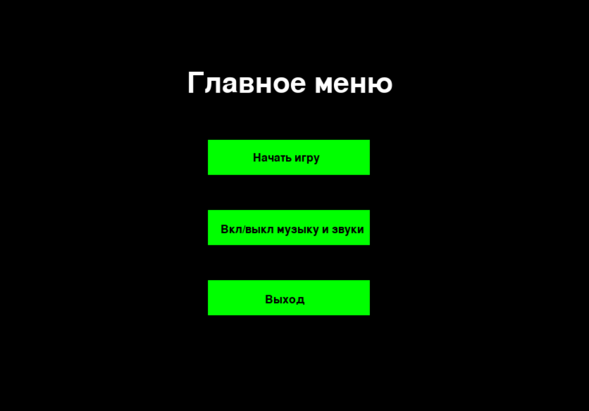

# Игра в жанре rogue like 

## Инструкция по установке

Если у вас уже установлен python3 - скачайте библиотеку pgzero

    pip install pgzero

А затем запустите игру командой 

    python3 game.py

## Руководство по игре

#### Ваша задача накормить кошечку, для этого Вы должны ловить корм kitecat, сделать это можно используя клавиши стрелок.  

#### Однако будьте осторожны, ведь рядом бегают собаки, которые так и хотят помешать вам помочь маленькой кошке.

## Интерфейс

#### На главном  экране представлены кнопки старта игры, включения/выключения музыки и выхода

## Соответствие Техническому Заданию

#### Проект соответствует всем пунктам задания:
    * Анимированные персонажи реализованы посредством отдельного класса
    * Есть главное меню 
    * Жанр игры "рогалик"
    * В игре есть музыка и звуки
    * Наличие нескольких врагов, которые передвигаются самостоятельно
    * Анимация у игрока и врагов
    * Читаемый код для удобства рефакторинга и понимания, с использованием грамотных и понятных имен на английском языке
     
Вспомогательные файлы находятся во вложенных папках с названиями "images" и "music" соответственно. Есть возможность запускать игру неограниченное количество раз, также результат игры виден сверху. Ход игры и текущую стадию можно отслеживать через терминал.
